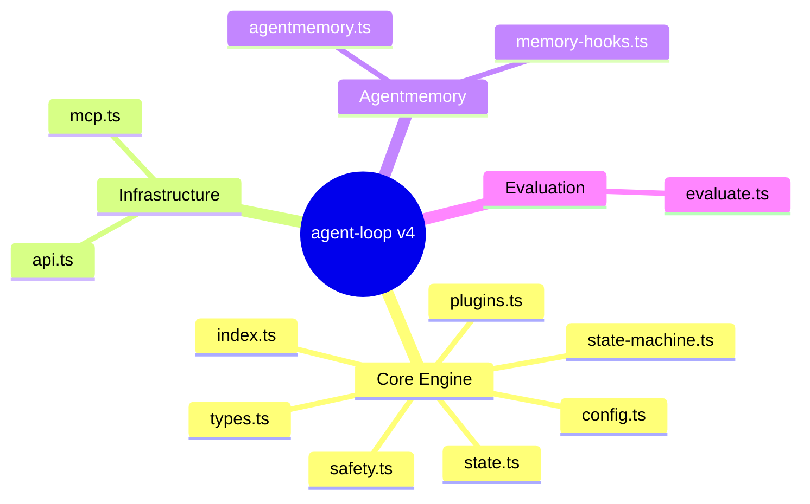

# agent-loop — v4 Architecture

Bun/TS loop orchestrator: 4-state machine, plugin phases, MCP execution, agentmemory hooks, HTTP/WS API. Zero runtime deps. ~1200 LOC (12 src files), 147 tests (11 test files).

## Architecture



## Modules by Subsystem

### Core Engine (7 files)
| File | Role |
|------|------|
| index.ts | Barrel export (12 lines) |
| types.ts | Core types: StateMachineState, PhaseDef, LoopConfig, PhaseResult, LoopState, LoopResult, Judgment |
| state-machine.ts | 4-state (init/run/verify/done) × 6-event flat lookup, ~49 LOC |
| state.ts | Dual persistence: STATE.md (YAML frontmatter) + state.json, custom YAML parser, ~147 LOC |
| safety.ts | executeWithTimeout (AbortController), max iterations cap (20), SIGINT handler, ~73 LOC |
| config.ts | DEFAULT_CONFIG, parseLoopArgs, mergeConfig (hard cap 20), ~81 LOC |
| plugins.ts | Plugin interface, HookContext, loadPlugins (dynamic import), executeHooks at 5 lifecycle points, ~116 LOC |

### Infrastructure (2 files)
| File | Role |
|------|------|
| mcp.ts | MCP subprocess execution via JSON-RPC 2.0 over stdin/stdout, ~167 LOC |
| api.ts | Bun.serve HTTP/WS server: GET /state, POST /start/stop/trigger, WebSocket broadcasts, ~103 LOC |

### Agentmemory (2 files)
| File | Role |
|------|------|
| agentmemory.ts | HTTP client to localhost:3111 (fetch), 5 endpoints: save, recall, archive, lesson, pulse, ~183 LOC |
| memory-hooks.ts | Lifecycle callbacks: onLoopComplete, onPhaseFailed, logPhaseContext, ~194 LOC |

### Evaluation (1 file)
| File | Role |
|------|------|
| evaluate.ts | LLM-based semantic evaluation or exit-code fallback, Judgment type with passed/reason/confidence, ~81 LOC |

## Data Flow

1. CLI → config.ts parses args, merges with DEFAULT_CONFIG
2. index.ts → state-machine.ts drives loop: execute phases → collect results → evaluate → persist → repeat or exit
3. Each phase runs via mcp.ts (MCP subprocess) or evaluate.ts (LLM eval)
4. state.ts persists after every transition (~6 writes per iteration)
5. plugins.ts hooks into lifecycle — loadPlugins + executeHooks at 5 points
6. memory-hooks.ts fires on completion/failure — fire-and-forget HTTP to agentmemory
7. api.ts serves state over HTTP/WS when daemon mode is active

## State Machine

```
  init ──RUN──> run ──VERIFY──> verify ──COMPLETE──> done
                   ^                  |
                   └──── LOOP ────────┘
```

| State | Events → Next |
|-------|-------------|
| init | RUN → run, ABORT → done |
| run | VERIFY → verify, ABORT → done |
| verify | COMPLETE → done, LOOP → init, FAILED → done, ABORT → done |
| done | (terminal) |

## Key Decisions

- **ADR-0001**: Raw HTTP (fetch to localhost:3111) over MCP subprocess for agentmemory — lower latency, smaller failure surface (`docs/adr/0001-raw-http-agentmemory-transport.md`)
- **Custom YAML parser**: No js-yaml dep. state.ts parses YAML frontmatter + falls back to JSON
- **Fire-and-forget memory ops**: All agentmemory calls are fire-and-forget with 2s timeout, no retry, errors swallowed
- **Ponytail patterns**: Flat lookup state machine (no OOP), AbortController for timeouts, mutable global for SIGINT

## Configuration

| Key | Default | Description |
|-----|---------|-------------|
| maxIterations | 3 (cap 20) | Loop iterations |
| task | "demo" | Task preset name |
| phases | all | Comma-separated phase filter |
| timeout | 30000 | Per-phase timeout ms |
| memory.enabled | false | Enable agentmemory hooks |
| port | 3000 | API server port |
| plugins | [] | Plugin file paths |

## Plugin System

5 hook points: `beforePhase` / `afterPhase` / `beforeLoop` / `afterLoop` / `onError`. Plugins are dynamically imported modules exporting `createPlugin(): Plugin`. Used by memory-hooks internally; extensible for user plugins.

## Test Strategy

147 tests across 11 test files. Run: `bun test __tests__/`

| Area | Files |
|------|-------|
| State machine | state-machine.test.ts |
| Persistence | state.test.ts |
| Safety | safety.test.ts |
| Config | config.test.ts |
| MCP execution | mcp.test.ts |
| Plugins | plugins.test.ts |
| Agentmemory | agentmemory.test.ts |
| Memory hooks | memory-hooks.test.ts |
| API server | api.test.ts |
| Evaluation | evaluate.test.ts |
| Daemon | daemon.test.ts |

## Quick Start

```bash
bun run src/index.ts start --task demo                    # run demo
bun run src/index.ts start --task demo --max-iterations 3  # 3 iterations
bun run src/index.ts start --task demo --phases scan,report # filter phases
bun run src/index.ts start --help                          # all options
```

State output: `_agent-loop-output/STATE.md` + `_agent-loop-output/state.json`.
